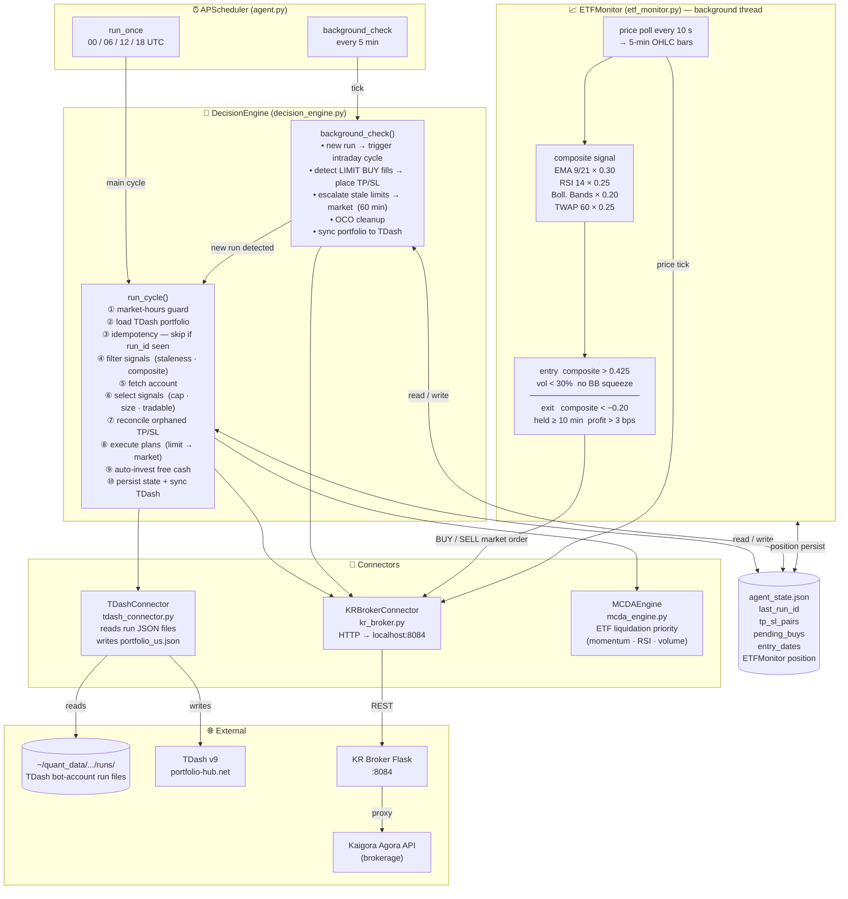

# Agent Trader — TDash v9 × KR Broker Integration
- URL: https://portfolio-hub.net
- Username: kr-agent@bot.local
- Password: KRAgent2026!

## Overview
An AI agent that bridges Trading Dashboard v9 signals with KR Broker execution.

## Architecture



## Components
- `agent.py` — Entry point; wires `DecisionEngine` + `ETFMonitor`, starts APScheduler
- `decision_engine.py` — Core trading brain: signal selection, smart order routing, TP/SL management, portfolio sync
- `etf_monitor.py` — Real-time QQQ/SPY quant monitor running in a background thread
- `tdash_connector.py` — Reads TDash signal run files; writes portfolio back to TDash bot account
- `kr_broker.py` — HTTP client for KR Broker Flask proxy (→ Kaigora Agora API)
- `mcda_engine.py` — Multi-criteria scoring used to prioritise which ETF to liquidate for cash

## Configuration
Edit `config.yaml` with your paths and preferences.

**Important — `tdash.data_dir` must point to the bot account's runs, not admin:**
```yaml
tdash:
  data_dir: "~/quant_data/users/kr-agent@bot.local/runs"  # bot account (US only)
  user: "kr-agent@bot.local"
```
The admin account runs a TSX (Canadian) portfolio. Pointing `data_dir` at admin's runs causes all signals to be wrong-market (.TO tickers) and eventually stale (admin doesn't run TDash on a regular cadence). Discovered 2026-04-09 when all 5 signals were dropped as stale — they were Canadian TSX tickers from the admin account's April 6 run, which was >72h old by April 9 18:30 UTC.

**Important:** Signal selection settings (`composite_threshold`, `max_positions`, `max_new_per_cycle`, `min_position_dollars`) must live under the `trading:` section — `decision_engine.py` reads from there. They were previously misplaced under `etf_monitor:` and silently ignored (hardcoded defaults were used instead).

### Key `trading:` settings
| Setting | Default | Purpose |
|---------|---------|---------|
| `composite_threshold` | 0.56 | Min TDash composite score for ADD/NEW signals (SELL/TRIM always pass) |
| `max_positions` | 10 | Hard cap on total positions |
| `max_new_per_cycle` | 2 | Max new names entered per decision cycle |
| `min_position_dollars` | 8000 | Min dollar size for any entry |

## Running
```bash
python agent.py
```

## Signal Filtering Pipeline
1. **Staleness** — drops signals older than `signal_refresh_days` (default 3 days)
2. **Composite threshold** — ADD/NEW dropped if score < `composite_threshold` (0.56)
3. **Tradable check** — ADD/NEW dropped if ticker not in Kaigora's asset universe (prevents silent failure at execution time)
4. **Min size** — dropped if dollar amount < `min_position_dollars`
5. **Position cap** — NEW dropped if at `max_positions`
6. **New-per-cycle cap** — NEW dropped if `max_new_per_cycle` already entered this cycle

SELL/TRIM skip checks 2–6 and are always executed.

## Smart Order Logic
| Scenario | Action |
|----------|--------|
| TDash entry > current price | Market order (better entry!) |
| TDash entry < current price | Limit order at TDash price |
| Gap > 2% | Log warning, proceed with market |
| No fill in 1 hour | Escalate to market order |

## MCDA Criteria
- Price momentum (20-day)
- RSI
- Volume trend
- Fee-aware: only sell if gain > 0.1%

## Known Issues & Fixes

### TP/SL wiped after LIMIT BUY escalation (fixed 2026-04-10)
When a LIMIT BUY times out and is escalated to a market order, `background_check` placed TP/SL for the new fill — then immediately cancelled them. Root cause: `_reconcile_tp_sl_pairs` was called with a stale account snapshot (fetched before the market order fired), so it saw the position as "not held."

**Fix (`decision_engine.py`):** After escalating any LIMIT BUYs, re-fetch the account before running `_reconcile_tp_sl_pairs`.

### TP/SL qty mismatch after TRIM (no code fix)
Each TRIM cycle sells shares but does not update the existing TP/SL order quantity. If enough TRIMs accumulate, the TP/SL will try to sell more shares than are held. Monitor TP/SL quantities after TRIM cycles and manually re-place if needed.

### ETFMonitor SELL not verified → position orphaned (fixed 2026-04-10)
`_execute_exit_check` discarded the broker's sell response. A soft rejection (`failedCount=1, filledCount=0`) looked like success — the position was cleared from state even though no shares were sold. On the next restart the monitor thought it was flat and could re-buy.

**Fix (`etf_monitor.py`):** Capture the result of `place_order`. If `filledCount == 0`, log an error and return without clearing position state so the next tick retries.

### Stale run triggers intraday cycle every 5 min indefinitely (fixed 2026-04-15)
When `run_cycle()` exits early (no signals, broker down, etc.) it skips the step that saves `last_run_id` to state. On the next `background_check` tick the same run appears new again, firing a redundant cycle every 5 minutes until a fresh TDash run arrives.

**Fix (`decision_engine.py`):** After `self.run_cycle()` returns in `background_check`, re-read state from disk and stamp `last_run_id = latest_run_id` if `run_cycle` didn't do it. This ensures a run is triggered at most once per background cycle regardless of early-exit path.

### ETFMonitor SELL qty exceeds actual holdings (fixed 2026-04-10)
Position qty is stored as `invest_amount / price` (Python float). The broker fills at a fractionally lower quantity (its own rounding). The SELL then asked for more shares than held → "Insufficient holdings to sell."

**Fix (`etf_monitor.py`):** Before placing a SELL, call `self.broker.get_position(ticker)` and use the broker's confirmed quantity. Eliminates all floating-point guesswork.
